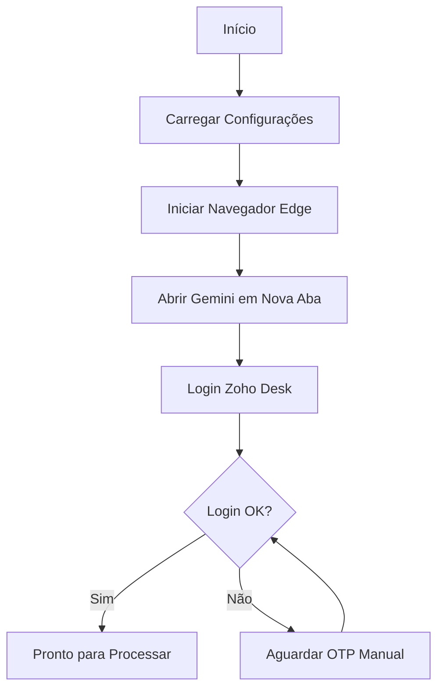
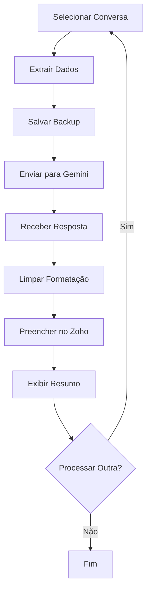

# 🤖 Assistente Stefan - Bot de Automação Zoho Desk

[](https://www.python.org/)
[](https://www.selenium.dev/)
[](https://ai.google.dev/)
[]()

Sistema de automação inteligente para atendimento ao cliente via Zoho Desk, integrado com Google Gemini AI para geração de respostas contextualizadas e personalizadas.

---

## 📋 Índice

- [Visão Geral](#-visão-geral)
- [Funcionalidades](#-funcionalidades)
- [Arquitetura](#-arquitetura)
- [Instalação](#-instalação)
- [Configuração](#-configuração)
- [Uso](#-uso)
- [Estrutura do Projeto](#-estrutura-do-projeto)
- [Fluxo de Operação](#-fluxo-de-operação)
- [Tecnologias](#-tecnologias)
- [Versões e Changelog](#-versões-e-changelog)
- [Troubleshooting](#-troubleshooting)

---

## 🎯 Visão Geral

O **Assistente Stefan** é um bot de automação desenvolvido para a **Era Verde Energia**, especializado em:

- 📱 Atendimento automatizado via WhatsApp (Zoho Desk)
- 🤖 Geração de respostas inteligentes com Google Gemini AI
- 📊 Extração e análise de conversas
- 💾 Backup automático de conversas (JSON, CSV, TXT)
- 🎨 Interface colorida no terminal para melhor visualização

### Objetivo Principal

Auxiliar clientes existentes na atualização de contratos devido à expansão da usina solar, mantendo um tom profissional, amigável e focado em benefícios.

---

## ✨ Funcionalidades

### 🔄 Modos de Operação

1. **Modo Manual**
   - Você seleciona as conversas manualmente
   - Controle total sobre cada interação
   - Confirmação antes de processar cada conversa

2. **Modo Autopilot** (Experimental)
   - Navegação automática entre conversas
   - Processamento contínuo de conversas pendentes
   - Memória de sessão para evitar reprocessamento

### 🧠 Inteligência Artificial

- **Gemini 2.5-flash**: Modelo rápido e eficiente
- **Dual-Tab Architecture**: Gemini em aba separada para melhor performance
- **Context-Aware**: Analisa todo o histórico da conversa
- **Limpeza Automática**: Remove formatação Markdown das respostas

### 📦 Extração de Dados

- **Informações do Cliente**:
  - Nome completo
  - Email
  - Telefone
  - Histórico completo de mensagens

- **Exportação Múltipla**:
  - JSON (estruturado)
  - CSV (planilha)
  - TXT (legível)

### 🎨 Interface Visual

- Sistema de logging colorido
- Mensagens categorizadas por tipo (sucesso, erro, aviso, info)
- Barras de progresso
- Resumos formatados
- Compatível com Windows CMD

---

## 🏗️ Arquitetura

```
┌─────────────────────────────────────────────────────────────┐
│                     ASSISTENTE STEFAN                       │
│                         (main.py)                           │
└────────────────────┬────────────────────────────────────────┘
                     │
        ┌────────────┴────────────┐
        │                         │
┌───────▼────────┐       ┌────────▼────────┐
│  Zoho Desk     │       │  Gemini AI      │
│  Automator     │◄─────►│  (Dual-Tab)     │
│  (zoho.py)     │       │  (gemini_web.py)│
└───────┬────────┘       └─────────────────┘
        │
        │
┌───────▼────────────────────────────────────┐
│         Selenium Utils                     │
│  - Extração de conversas                  │
│  - Navegação                               │
│  - Preenchimento de respostas              │
└───────┬────────────────────────────────────┘
        │
┌───────▼────────────────────────────────────┐
│         Utils & Config                     │
│  - Colored Logger                          │
│  - Text Processing                         │
│  - Settings                                │
└────────────────────────────────────────────┘
```

### Componentes Principais

#### 1. **Core Modules**

- **`zoho.py`**: Orquestrador principal
  - Gerenciamento de sessão do navegador
  - Login automático com OTP
  - Loop de processamento de conversas
  - Integração com Gemini

- **`gemini_web.py`**: Cliente Gemini Web
  - Arquitetura dual-tab
  - Envio de prompts
  - Captura de respostas
  - Limpeza de formatação Markdown

- **`selenium_utils.py`**: Utilitários Selenium
  - Extração de conversas (V3.3)
  - Detecção de mudança de conversa (Staleness)
  - Navegação entre seções
  - Preenchimento de campos

- **`gemini.py`**: Cliente Gemini API (Legado)
  - Integração direta com API
  - Formatação de prompts
  - Safety settings

#### 2. **Configuration**

- **`settings.py`**: Configurações centralizadas
  - Caminhos de diretórios
  - Credenciais (API keys)
  - Seletores CSS/XPath
  - System prompt do Gemini
  - URLs e timeouts

#### 3. **Utilities**

- **`colored_logger.py`**: Sistema de logging visual
  - Mensagens coloridas
  - Barras de progresso
  - Caixas de informação
  - Resumos formatados

- **`text_processing.py`**: Processamento de texto
  - Exportação CSV
  - Exportação TXT
  - Sanitização de nomes

---

## 🚀 Instalação

### Pré-requisitos

- Python 3.8 ou superior
- Microsoft Edge instalado
- Conta Zoho Desk com acesso
- Google Gemini API Key

### Passo a Passo

1. **Clone o repositório**
```bash
git clone https://github.com/stefanprati-rgb/bot-zoho.git
cd bot-zoho
```

2. **Instale as dependências**
```bash
pip install -r requirements.txt
```

3. **Configure as credenciais**

Edite `config/settings.py`:
```python
# API Gemini
GEMINI_API_KEY = "sua-api-key-aqui"

# Credenciais Zoho (em zoho.py)
self.email = "seu-email@empresa.com"
self.password = "sua-senha"
```

4. **Configure o perfil do navegador**

O bot usa o perfil do Edge para manter a sessão. Certifique-se de:
- Ter feito login no Zoho Desk pelo menos uma vez manualmente
- Fechar todas as janelas do Edge antes de executar o bot

---

## ⚙️ Configuração

### Estrutura de Diretórios

O bot cria automaticamente os seguintes diretórios:

```
Bot/
├── backup/          # Backups de conversas (JSON, CSV, TXT)
├── logs/            # Logs de execução
├── output/          # Respostas geradas
├── conversas/       # (Legado)
└── browser_profile/ # Perfil do navegador Edge
```

### Seletores CSS

Os seletores estão centralizados em `config/settings.py`:

- **Zoho Desk**: Login, navegação, chat, modals
- **Gemini Web**: Input, botões, histórico

### System Prompt

O comportamento do Gemini é controlado pelo `SYSTEM_PROMPT` em `settings.py`:

```python
SYSTEM_PROMPT = """
Você é Stefan, assistente virtual especializado da Era Verde Energia...
"""
```

Personalize conforme necessário para seu caso de uso.

---

## 💻 Uso

### Execução Básica

```bash
python main.py
```

### Fluxo de Uso

1. **Escolha o modo de operação**
   ```
   1. Manual (Você seleciona as conversas)
   2. Autopilot (O bot navega e processa sozinho)
   ```

2. **Login automático**
   - O bot abre o Edge
   - Tenta login automático
   - Se necessário, aguarda OTP manual

3. **Processamento de conversas**

   **Modo Manual:**
   - Selecione uma conversa no Zoho
   - Pressione ENTER
   - Confirme o processamento (s/n)
   - Revise a resposta gerada
   - Repita para outras conversas

   **Modo Autopilot:**
   - O bot navega automaticamente
   - Processa todas as conversas pendentes
   - Aguarda novas conversas

### Demonstração do Sistema Colorido

```bash
python demo_colors.py
```

Mostra todas as funcionalidades visuais do sistema de logging.

---

## 📁 Estrutura do Projeto

```
Bot/
│
├── main.py                      # Ponto de entrada
├── demo_colors.py               # Demonstração do sistema colorido
├── requirements.txt             # Dependências Python
├── README.md                    # Este arquivo
├── LOGGING_COLORIDO.md          # Documentação do sistema de logging
│
├── config/
│   └── settings.py              # Configurações centralizadas
│
├── core/
│   ├── zoho.py                  # Orquestrador principal
│   ├── gemini_web.py            # Cliente Gemini Web (Dual-Tab)
│   ├── gemini.py                # Cliente Gemini API (Legado)
│   └── selenium_utils.py        # Utilitários Selenium
│
├── utils/
│   ├── colored_logger.py        # Sistema de logging colorido
│   └── text_processing.py      # Processamento e exportação
│
├── backup/                      # Backups de conversas
├── logs/                        # Logs de execução
├── output/                      # Respostas geradas
└── browser_profile/             # Perfil do Edge
```

---

## 🔄 Fluxo de Operação

### 1. Inicialização



### 2. Processamento de Conversa



### 3. Extração de Conversa (V3.3)

- **Staleness Detection**: Detecta mudança de conversa
- **Virtualização**: Suporta listas virtualizadas
- **Multi-fallback**: Múltiplos seletores para robustez
- **Ordenação**: Mensagens ordenadas por timestamp

---

## 🛠️ Tecnologias

### Backend

- **Python 3.8+**: Linguagem principal
- **Selenium 4.0+**: Automação web
- **Colorama**: Cores no terminal Windows

### APIs & Serviços

- **Google Gemini 2.5-flash**: IA generativa
- **Zoho Desk**: Plataforma de atendimento
- **Microsoft Edge WebDriver**: Automação do navegador

### Bibliotecas Auxiliares

- **pyperclip**: Manipulação de clipboard
- **json**: Serialização de dados
- **csv**: Exportação de planilhas
- **logging**: Sistema de logs
- **datetime**: Manipulação de datas

---

## 📊 Versões e Changelog

### v3.17 (Atual) - 29/11/2024

**Novidades:**
- ✨ Sistema de logging colorido completo
- 🧹 Limpeza automática de formatação Markdown do Gemini
- 📝 Documentação completa do projeto
- 🎨 Interface visual melhorada no CMD

**Melhorias:**
- Remove `**negrito**`, `*itálico*`, `[citações]`
- Cabeçalhos estilizados
- Barras de progresso
- Resumos formatados

### v3.16 - 28/11/2024

**Correções:**
- 🐛 Corrigido erro de MAX_TOKENS (limite aumentado para 1024)
- 🐛 Corrigida captura de nome de cliente (multi-fallback)

### v3.15 - Anterior

**Novidades:**
- 🔒 Safety Settings (BLOCK_NONE) para API Gemini
- 🛡️ Evita bloqueios por "finish_reason: 2"

### v3.10 - Anterior

**Novidades:**
- ✍️ Pré-preenchimento focado em ProseMirror (HTML `<p>`)

### v3.8 - Anterior

**Novidades:**
- 🔄 Staleness Detection para mudança de conversa
- 📋 Lista virtualizada

### v3.3 - Anterior

**Novidades:**
- 📊 Extração V3.3 (lista virtualizada, seletores refinados)

---

## 🔧 Troubleshooting

### Problemas Comuns

#### 1. Erro ao iniciar navegador

**Sintoma:**
```
[ERRO] Erro ao iniciar navegador: ...
```

**Solução:**
- Feche todas as janelas do Edge
- Verifique se o perfil está correto em `settings.py`
- Execute como administrador se necessário

#### 2. Timeout no login

**Sintoma:**
```
[ERRO] Timeout aguardando conclusão do login
```

**Solução:**
- Insira o código OTP manualmente quando solicitado
- Verifique se as credenciais estão corretas
- Aumente o `TIMEOUT_LOGIN_MANUAL_SEGUNDOS` se necessário

#### 3. Não encontra conversa

**Sintoma:**
```
[ERRO] Erro ao carregar a primeira conversa
```

**Solução:**
- Certifique-se de que há conversas abertas no Zoho
- Aguarde a página carregar completamente antes de pressionar ENTER
- Verifique os seletores CSS em `settings.py`

#### 4. Gemini não responde

**Sintoma:**
```
Falha ao obter resposta do Gemini Web
```

**Solução:**
- Verifique se a aba do Gemini está aberta
- Confirme se a API key está correta
- Verifique a conexão com internet

#### 5. Caracteres estranhos no CMD

**Sintoma:**
```
UnicodeEncodeError: 'charmap' codec can't encode...
```

**Solução:**
- O sistema já foi otimizado para Windows
- Evite usar emojis ou caracteres especiais nas mensagens
- Use apenas ASCII em textos críticos

### Logs

Os logs completos ficam em `logs/execucao_YYYYMMDD_HHMMSS.txt`

Consulte para debugging detalhado.

---

## 📞 Suporte

Para questões ou problemas:

1. Verifique a seção [Troubleshooting](#-troubleshooting)
2. Consulte os logs em `logs/`
3. Revise a documentação em `LOGGING_COLORIDO.md`

---

## 📄 Licença

Este projeto é de uso privado da **Era Verde Energia**.

Todos os direitos reservados © 2024

---

## 👨‍💻 Desenvolvedor

**Stefan Pratti**
- GitHub: [@stefanprati-rgb](https://github.com/stefanprati-rgb)
- Projeto: Bot Zoho - Era Verde Energia

---

## 🙏 Agradecimentos

- **Google Gemini**: IA generativa
- **Zoho**: Plataforma de atendimento
- **Selenium**: Framework de automação
- **Colorama**: Biblioteca de cores para terminal

---

**Última atualização:** 29/11/2024
**Versão:** 3.17
